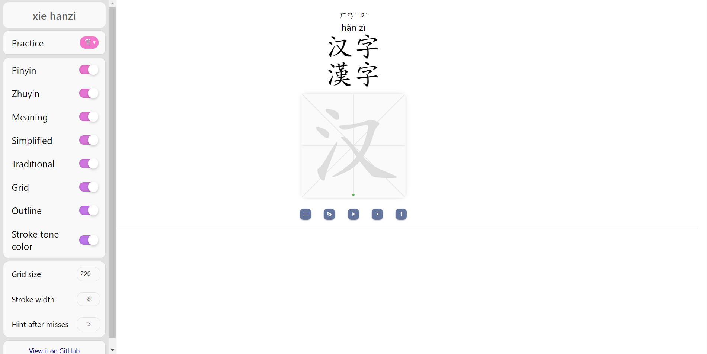

import styles from '../styles.module.css';

# Change Preferences

### Practice Simplified or Traditional characters

Click on menu button and in left side bar use drop down menu to select between simplified and traditional characters.

### Show/Hide Simplified or Traditional characters

Use the side bar to toggle on/off for showing/hiding Simplified or Traditional fields

### Show/Hide Pinyin or Zhuyin of characters

Use the side bar to toggle on/off for showing/hiding Pinyin or Zhuyin of characters

### Change grid size for writing characters

The default grid size is 300 which can be changed from side bar. Enter desired size to change the grid size.

### Show/Hide tone color for strokes

The color of strokes is matched with first pinyin of the characters. The default is colored stroked which can be changed from sidebar.

### Show/Hide Outline

The outline can be used as hint for writing characters strokes. The default can be change to hide colored strokes.
