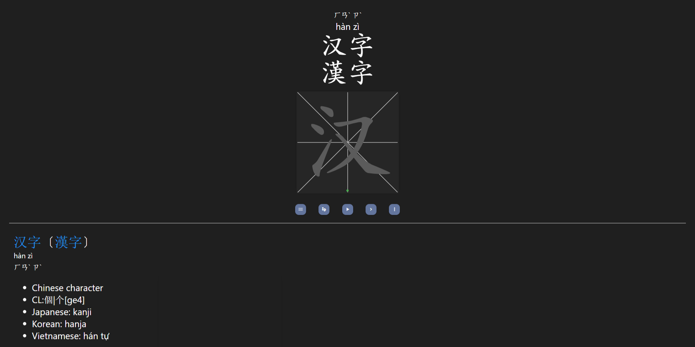

# Features

### Five notes type
The deck contains notes with five note types to practice meaning, pinyin or zhuyin, audio, tone marks and writing of characters.
The card types are
1. Learn meaning of characters
2. Learn Pinyin or Zhuyin of characters
3. Learn pronunciation using audio and Pinyin or Zhuyin
4. Learn tone marks of characters 
5. Learn strokes order of characters

### Colored strokes
The strokes color matches the tone color of the first pinyin if multiple pinyin exists.

### Practice Simplified & Traditional characters

Easily toggle between simplified and traditional to practice both characters.

### Pinyin & Zhuyin support

### Audio
HSK1 - HSK9 audio included in the decks

### Night Mode

### Customization

Change grid size, pen size, show or hide the fields using left side bar.

### More info sidebar
- View meaning by opening [Pleco dictionary](https://www.pleco.com/) on phone.
- View character details using [HanziCraft](https://hanzicraft.com/) 
- View mnemonics of characters using [rtega.be/chmn](http://rtega.be/chmn/)
- View characters meaning on [Youdao](http://dict.youdao.com)
- View strokes order and stories on [CharacterPop](https://characterpop.com)
- View sentences made of characters on [Tatoeba](https://tatoeba.org/en/)

**Note: Some changes will get reflect from next card.**
